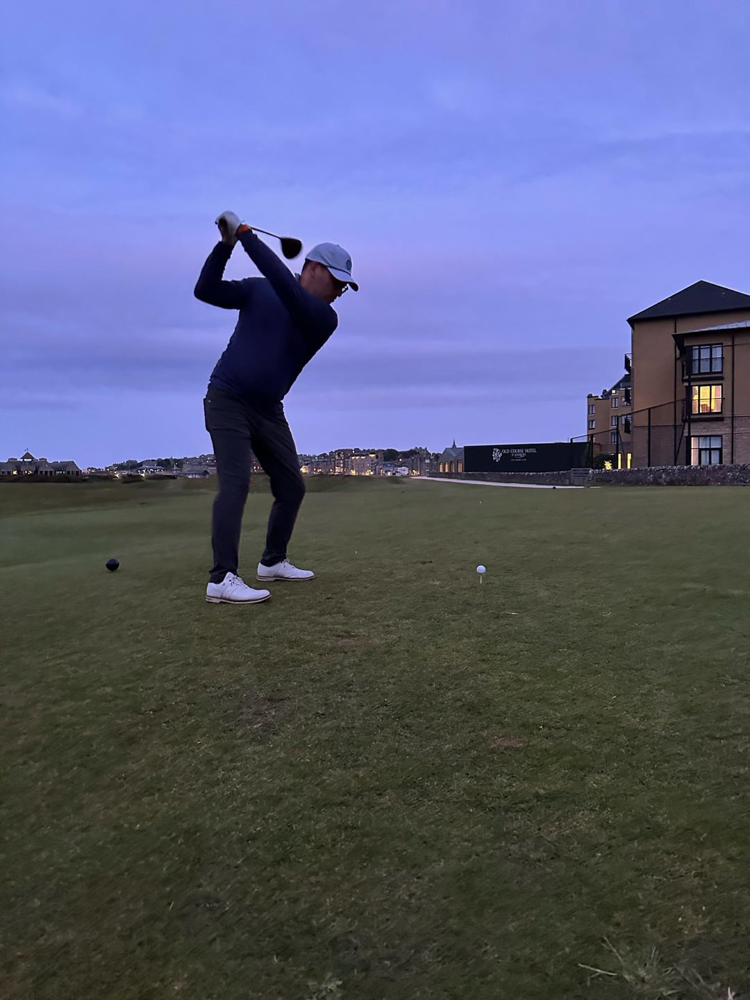
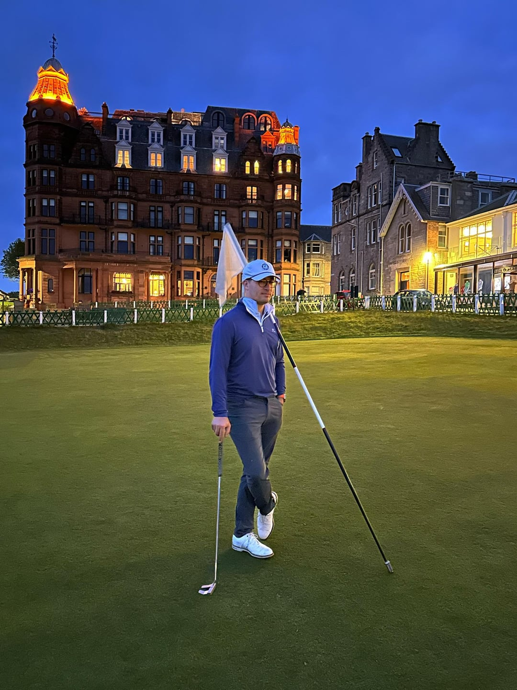

# Playing the Old Course at St. Andrews: A 24-Hour Odyssey

A year ago today, I played the Old Course at St. Andrews. Not just played it—I *earned* it. But the story starts a little before that.

## The Bachelor Party That Went North (Literally)

For my bachelor party, a group of friends and I flew to Scotland. Only two of us actually golf, but we sprinkled in just enough golf to keep things interesting—alongside the real stars of the trip: sightseeing, scotch, and general shenanigans.

Jay and I kicked things off by playing North Berwick on the first day. It’s still my favorite golf course in the world. The views, the quirks, the holes that feel like they were designed by nature itself—it’s just magic.

That afternoon, we wandered around Edinburgh. We somehow found a cricket batting cage (note: not our sport), sampled our way through a few whisky bars, and ended the night at a Brazilian steakhouse because, why not?

## The Midnight Pilgrimage to St. Andrews

At 10:30pm, Jay and I packed up and hit the road, leaving the cobbled streets of Edinburgh for the birthplace of golf. It’s about a 90-minute drive to St. Andrews, and we arrived just after midnight. We parked by The Old Course Hotel, slung our bags over our shoulders, and walked up the 18th fairway in the dark.

We were heading for the Old Pavilion to get in the singles queue—a historic and slightly masochistic process that, until recently, was your best chance of getting onto the Old Course without a tee time.

### How the Singles Queue Worked (RIP)

In the past, golfers could line up outside the Old Pavilion during the night and hope to snag a tee time the next morning due to cancellations or no-shows. You didn’t need a reservation—just patience, persistence, and the willingness to sleep on concrete.

Jay and I were the 16th and 17th people in line. We had no chairs. We barely sat. But the crowd around us was lively. The guys in front of us were a group of friendly Canadians on a week-long golf binge, and we passed around a bottle of Kingsbarns whisky as the night went on.

By the time the sun started rising around 4:30am, we’d been awake for 24 hours.

## Hope, Heartbreak, and a Really Good Sausage Roll

Eventually, the staff opened the doors and started assigning tee times. We watched hopefully as the line crept forward… and then stopped. All the tee times were gone by the time they got to us.

We were told to come back at 9am in case of cancellations, but also warned there wasn’t a high likelihood we’d be able to play *together*. That stung.

Trying to stay positive, we wandered into town and grabbed breakfast at **Munch**, where I had a genuinely incredible sausage roll. Highly recommend if you’re in St. Andrews.

We came back at 9. No luck. They told us to come back *again* at 4:30pm for possible late-afternoon rounds. That might sound crazy late, but in Scotland on June 1st, the sun doesn’t set until close to 10pm.

## Making the Most of It

Dejected but determined, Jay and I took our clubs to the **New Course**—a misnomer if there ever was one. It was built in 1895, and while it’s not the Old, it’s still a fantastic test of golf.

> No carts, of course. And still no sleep.

I laid down on the tee box—*twice*—between shots, trying to grab a minute of rest. It was worth it. The New Course has some incredible approach shots and a classic links layout that’s absolutely worth playing if you’re in town.

## The Old Course, At Last

We finished our round, limped back to the Pavilion, and waited.

There was a tee time for a single. Then another. Jay and I passed, wanting to hold out for a chance to play together. Eventually, we were told that a 6:30pm slot had opened—but the other two players were R&A members, and they declined to let anyone else join.

We stood just off to the right of the first tee, devastated. This was *it*—the whole reason we came. It’d been nearly 18 hours since we got in line.

Then the starter walked up to us.

> “The 6:30 didn’t show. It’s yours if you want it. You probably won’t get all 18 in, but you’re welcome to try.”

We were on that tee in seconds.

Jay striped an iron. I topped a 5-wood that somehow stayed on the fairway. But we were playing. *Together*. At the Old Course. With no one else around.

## The Final Stretch

My brother had taken the train up and ended up playing the Jubilee Course. At some point around the 11th tee, we saw a lone figure walking toward us—it was him, come to walk the final stretch with us.

By the 15th tee, we were starving. It’d been almost 24 hours since we’d eaten. Our friends had made it to town and were at the Rusacks Hotel. We begged for food. They eventually walked out to meet us with cold burgers and sweet potato fries on the 15th fairway.

Best meal of my life.

The sun started to dip low on 17—the famous **Road Hole**—and we used phone flashlights to find our tee shots. By 18, it was pitch black. We lit up the tee box with our phones and hit our final shots into the night.

Jay stuck one. I ended up in the Valley of Sin.

We both made our putts.

## Exhausted, Exhilarated, Grateful

We hugged on the 18th green—hungry, dehydrated, sleepless, euphoric.

We’d done it.

We played the Old Course together. I’ll never forget a single moment of it, and I wouldn’t change a single thing. Not the failed attempts, the all-nighter, or the cold food on the fairway.

Some rounds are special because of where they are.

This one was special because of *everything*.
